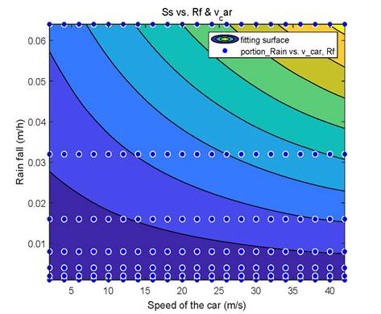

### A Model to Predict the Maximum Car Speed in the Rain
The speed that a car can maintain on rainy days
depends on many factors. This project will first introduce a model to quantify
the visibility of the driver using the ratio between the surface area of all
raindrops on windshield and the area of the windshield. In addition to driver's
comfortability of visibility, we also take the sudden brake, sleep-deprived
driving, road condition and light change, into the safe speed consideration. In 
this project, we build a model to compute the safe speed of the car under
real-life considerations by combining mathematical and physical knowledge to
provide a concrete and useful insight into this problem.

&nbsp;&nbsp;&nbsp;&nbsp;
</video>&nbsp;&nbsp;&nbsp;<video width="515" height="260" controls loop autoplay>
  <source src="index_files/v_0_f_0.5_Rf_0.01.mp4" type="video/mp4">
</video>

